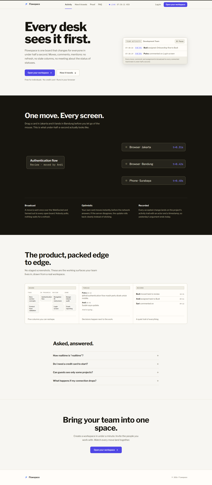
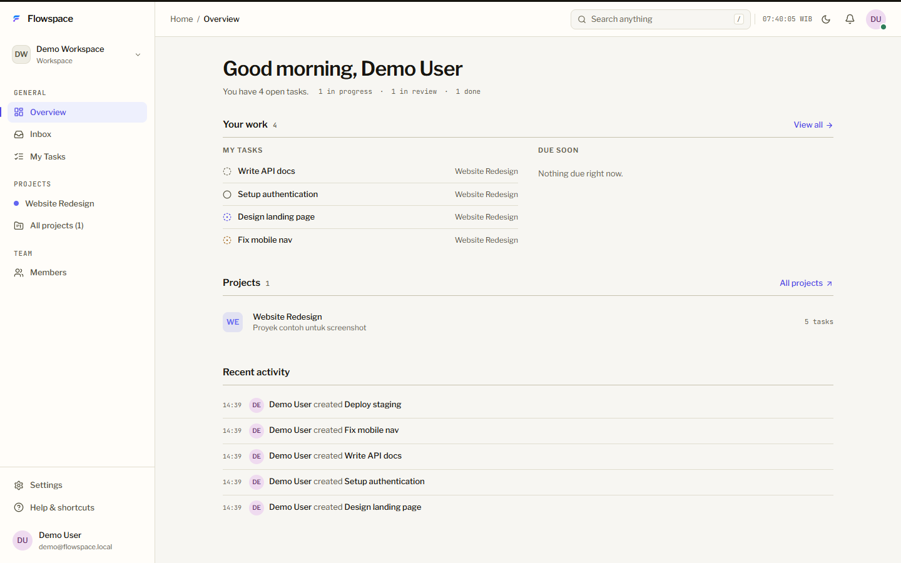
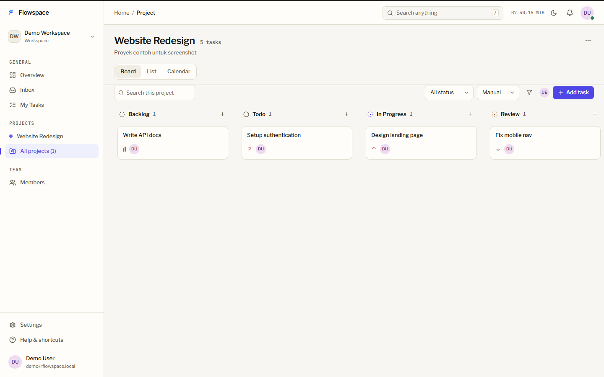

# Flowspace

Aplikasi project management dan kolaborasi tim realtime. Satu workspace bisa menampung beberapa project, tiap project punya board kanban (drag & drop), tampilan list, dan kalender. Task bisa dikomentari, di-mention, diberi label dan prioritas. Perubahan sekecil apa pun, pindah kartu, komentar baru, atau notifikasi, langsung muncul di layar semua anggota tanpa refresh.

## Isinya

- Workspace dengan role owner, admin, member, dan guest
- Project: board, list, calendar, member project, activity log
- Task: status backlog sampai done, prioritas, assignee, label, due date, attachment, komentar + mention + reaction
- Realtime: task, komentar, typing indicator, presence online, notifikasi (pakai websocket)
- Inbox notifikasi, global search, undangan member via email/token
- Login email/password dan Google OAuth
- Dark/light mode, shortcut keyboard, layout responsif

## Teknologi

Backend: Laravel 13, Sanctum (token), Reverb (websocket), MySQL, Redis (queue + cache).

Frontend: React 19 + TypeScript, Vite, Tailwind CSS, React Router, TanStack Query, Zustand.

## Cara menjalankan

### 0. Prasyarat

Butuh: PHP 8.3+, Composer, Node 20+, MySQL, Redis. Catatan: `npm run dev` di bawah ini untuk Windows. Linux/macOS ikut bagian "Cara manual".

Cek versi yang terpasang:

```bash
php -v          # harus 8.3+
composer -V
node -v         # harus 20+
mysql --version
redis-cli ping  # harus jawab PONG kalau Redis jalan
```

### 1. Siapkan MySQL + Redis (pilih salah satu)

**Opsi A: Docker (disarankan, paling gampang)**

```bash
docker compose up -d
docker compose ps
```

File `docker-compose.yml` di root sudah disamakan dengan default `backend/.env.example` (`flowspace` / `root` / password kosong / port standar), jadi tidak perlu ubah `.env` untuk bagian database. Database `flowspace` dibuat otomatis oleh container.

**Opsi B: MySQL/Redis manual (Laragon, XAMPP, brew, apt, dsb.)**

Pastikan kedua service jalan di port standar (`3306` dan `6379`), lalu bikin database kosong dulu:

```bash
mysql -u root -p -e "CREATE DATABASE flowspace CHARACTER SET utf8mb4 COLLATE utf8mb4_unicode_ci;"
```

Kalau MySQL kamu ber-password, catat passwordnya untuk langkah `DB_PASSWORD` di bawah.

### 2. Backend

```bash
cd backend
composer install
cp .env.example .env
```

Kalau pakai **Opsi B dengan MySQL ber-password**, sesuaikan dulu di `backend/.env`:

```
DB_PASSWORD=password-mysql-kamu
```

Lalu lanjut:

```bash
php artisan key:generate
php artisan migrate --seed
php artisan storage:link
cd ..
```

`migrate --seed` mengisi data contoh (login: `putra@flowspace.app` / `password123`). Tanpa `--seed` juga tidak apa, nanti daftar akun baru dan mulai dari kosong.

### 3. Frontend

```bash
cd frontend
npm install
# opsional, hanya kalau mau ubah default:
# cp .env.example .env
cd ..
```

Tanpa `.env`, frontend tetap jalan karena kode punya fallback ke nilai yang sama dengan `.env.example`. Satu-satunya yang wajib sama adalah `VITE_REVERB_APP_KEY` (frontend) dengan `REVERB_APP_KEY` (backend). Default keduanya `flowspace`.

### 4. Jalankan semuanya

Paling gampang dari root (Windows):

```bash
npm run dev
```

Ini menyalakan API (`:8000`), websocket (`:8080`), queue, scheduler, dan Vite (`:5173`). Kalau MySQL/Redis belum jalan, `dev.mjs` memberi tahu dan mencoba menjalankannya otomatis. Buka `http://localhost:5173`, selesai.

### Cara manual (Linux, macOS, atau kalau mau jalanin satuan)

Pastikan MySQL + Redis sudah jalan dulu (Opsi A atau B di atas), lalu buka dua terminal dari root:

```bash
# terminal 1: backend + websocket + queue
cd backend
php artisan serve --port=8000
php artisan reverb:start --port=8080
php artisan queue:work --tries=1

# terminal 2: frontend
cd frontend
npm run dev -- --port=5173
```

Perintah bantuan: `npm run api` untuk backend saja, `npm run web` untuk frontend saja. Matikan semuanya dengan `npm run stop` (Windows) atau `Ctrl+C` (manual).

Google login sifatnya opsional, isi `GOOGLE_CLIENT_ID` dan kawan-kawannya di `backend/.env` kalau mau dipakai.

### Kalau gagal jalan (troubleshooting)

| Gejala | Penyebab umum | Perbaikan |
|---|---|---|
| `Unknown database 'flowspace'` saat migrate | Database belum dibuat (Opsi B) | Jalankan perintah `CREATE DATABASE` di Opsi B, atau pakai Docker (Opsi A) |
| `Connection refused` ke `3306` / `6379` | MySQL/Redis belum jalan | `docker compose up -d`, atau start service manual, lalu `redis-cli ping` dan cek `mysql -u root -p -e "SELECT 1;"` |
| `composer install` error soal versi PHP | PHP < 8.3 | Upgrade ke PHP 8.3+ (`php -v` untuk cek) |
| `No application encryption key` | `key:generate` belum jalan | `cd backend && php artisan key:generate` |
| Port `8000/8080/5173` bentrok | Port dipakai app lain | Hentikan app lain, atau `npm run stop` (Windows) lalu ulangi |
| Realtime tidak update | Key Reverb beda / `reverb:start` mati | Samakan `VITE_REVERB_APP_KEY` dengan `REVERB_APP_KEY`, pastikan `reverb:start` + `queue:work` jalan |
| Upload/attachment 404 | `storage:link` belum jalan | `cd backend && php artisan storage:link` |

## Struktur folder

```
backend/            API Laravel (routes di backend/routes/api.php)
frontend/           SPA React (entry di frontend/src, routing di App.tsx)
screenshots/        Tangkapan layar tiap halaman
dev.mjs             Orkestrator dev, jalanin semua service dari root
docker-compose.yml  MySQL + Redis lokal via Docker (Opsi A)
```

## Tampilan

Landing page:



Dashboard:



Board project:



Screenshot halaman lain (login, register, list, my tasks, inbox, workspaces, settings, dsb.) ada di folder `screenshots/`.

## Lisensi

MIT. Lihat `LICENSE`.
